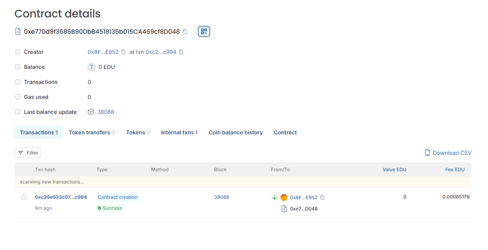

Certainly! Here’s the `README.md` content formatted without code blocks:

---

# Teacher Performance Reward Smart Contract

## Vision

The `TeacherPerformanceReward` smart contract is designed to reward teachers based on their performance metrics. By evaluating teacher performance through a set of criteria, the contract facilitates the distribution of rewards in the form of Ether. This system aims to incentivize high-quality teaching and recognize the efforts of educators.

## Project Features

- **Performance Evaluation**: Allows an admin to set performance metrics for teachers based on student feedback, student improvement, peer reviews, and teacher experience.
- **Reward Mechanism**: Grants rewards to teachers who meet or exceed a specified performance threshold.
- **Eligibility Check**: Provides a function to check if a teacher is eligible for a reward based on their performance score.
- **Ether Deposit**: The contract can accept Ether deposits, which can then be used for rewards.

## Future Scope

1. **Dynamic Reward System**: Implement dynamic reward amounts based on the performance score rather than a fixed value.
2. **Enhanced Performance Metrics**: Expand the performance criteria to include additional metrics or weights.
3. **Multi-Level Admin Roles**: Introduce multi-level admin roles for more granular control over reward distribution.
4. **User Interface**: Develop a front-end application to interact with the contract, making it easier for admins to set performance data and manage rewards.
5. **Integration with Educational Platforms**: Integrate with existing educational platforms to automatically fetch and update performance metrics.
6. **Security Audits**: Conduct formal security audits to ensure the robustness of the contract.

## Project Structure

- **TeacherPerformanceReward.sol**: The main smart contract file containing all the functionality for performance management and reward distribution.
- **README.md**: Documentation file outlining the vision, features, future scope, and developer details.
- **tests/**: Directory for unit tests (if applicable) to validate contract functionality.
- **scripts/**: Directory for deployment scripts (if applicable).
- **frontend/**: Directory for the front-end application (if applicable).

## Developer Details

- **Project Lead**: Srikar Bitla 
  - **Email**: [bitlasrikar.email@example.com]
  - **GitHub**: [Your GitHub Profile]

## Deployment
 Chain Name: Educhain open campus 
 Contract ID: 0xe770d9f3686b90dbb4518135b015ca469cf8d048
 

## License

This project is licensed under the MIT License - see the [LICENSE](LICENSE) file for details.

## Installation and Usage

To deploy and use the `TeacherPerformanceReward` contract, follow these steps:

1. **Clone the Repository**:
   - `git clone https://github.com/yourusername/TeacherPerformanceReward.git`

2. **Install Dependencies**:
   Navigate to the project directory and install any required dependencies. For example, if using Hardhat:
   - `npm install`

3. **Deploy the Contract**:
   Deploy the contract to your desired Ethereum network. Modify the deployment script as needed.

4. **Interact with the Contract**:
   Use a tool like Remix, Hardhat, or Truffle to interact with the deployed contract.

For further details and instructions, please refer to the documentation in the repository.

---

